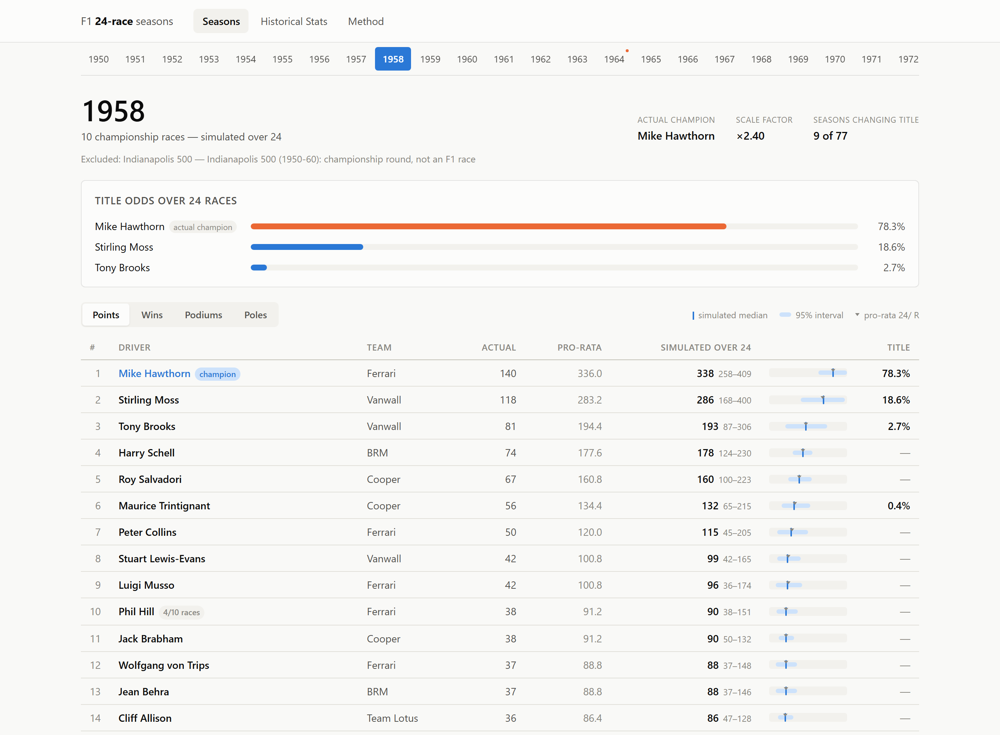
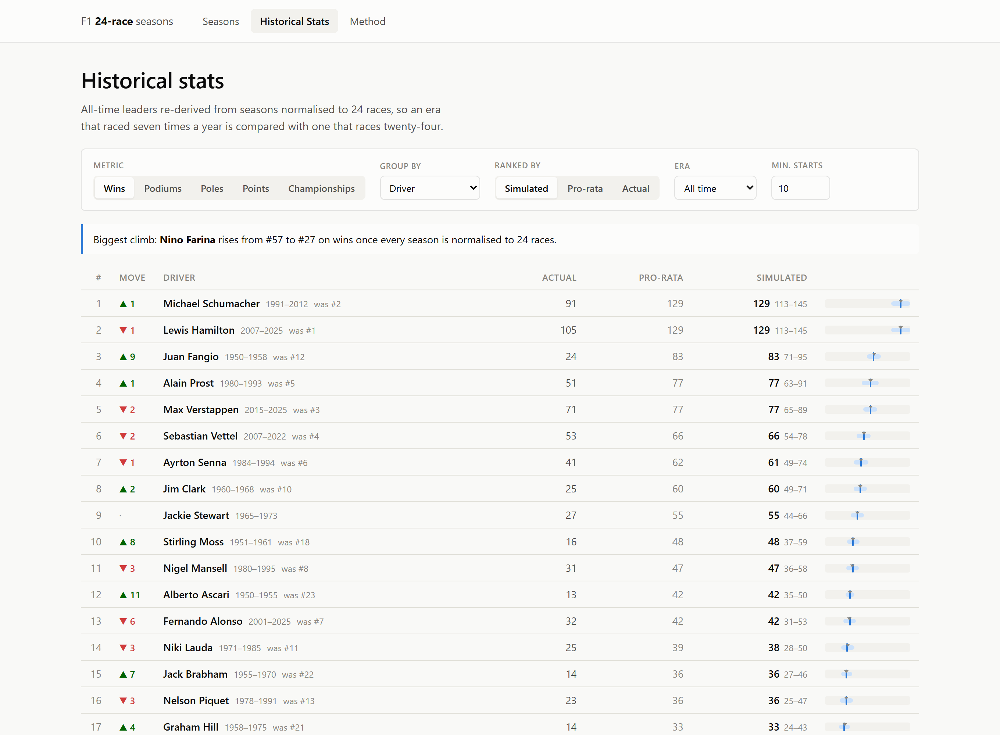
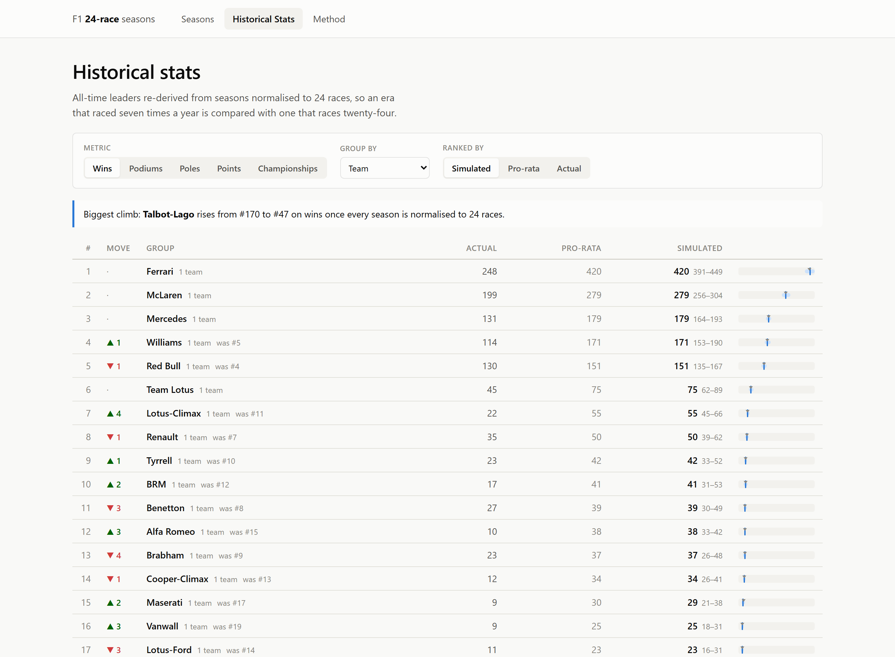
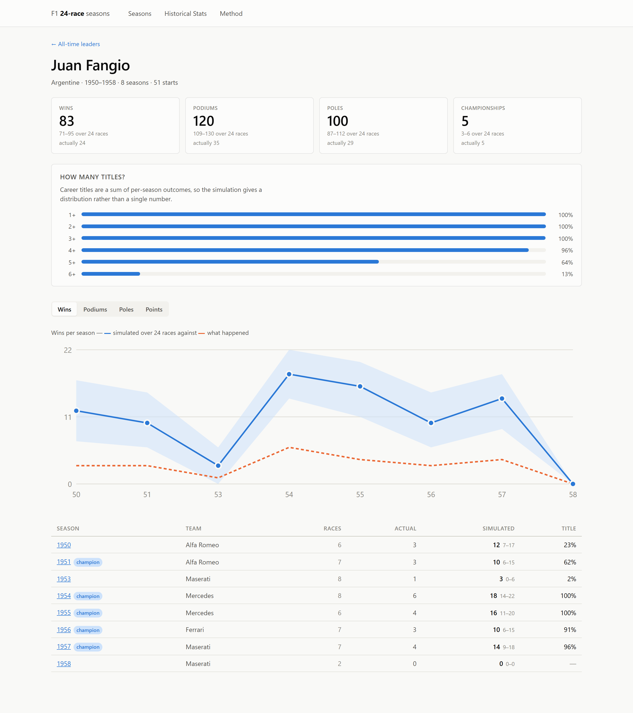
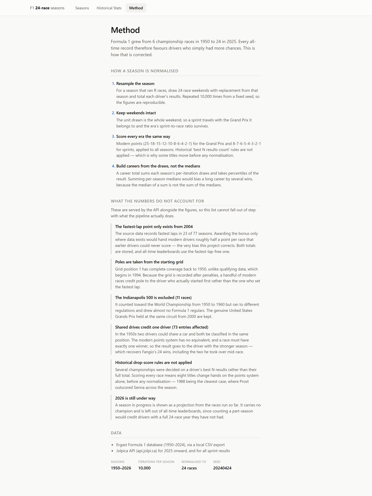

# F1 24-Race Normalized Seasons

## Tech Stack


Formula 1 season length has grown from **7 championship rounds in 1950 to 24 in
2024** — 6 to 24 once the Indianapolis 500, which counted for the title but was
not an F1 race, is set aside. Every all-time leaderboard — wins, podiums, poles, championships — is
therefore biased toward modern drivers, who simply had three times the
opportunities.

This project removes that bias. It re-simulates **every season from 1950 to 2026
as if it ran 24 races**, then re-derives both per-season standings and all-time
leaderboards from those simulations.

The result is a leaderboard that answers "who was the best?" rather than "who
was around when there were the most races?"

Two further corrections sit on top of it, because opportunity is not the only
thing an all-time table gets wrong. A **win is weighted by how contested it
was**, from an Elo rating built over every pairwise result in the sport's
history — 24 wins against Fangio is not 24 wins against an empty road. And a
season can be **raced out rather than resampled**, so a championship that the
calendar cut short can be decided by whoever was quickest at the end instead of
whoever happened to be ahead.

---

## Seasons

Pick any year and see what it would have looked like over 24 races. Every row
carries all three bases side by side — what actually happened, the naive `24/R`
pro-rata figure, and the simulated median with its 95% interval — so the
normalisation is never a black box.



1958 is the case the whole project exists for. Stirling Moss won four races to
Mike Hawthorn's one and still lost the title by a point, because only a driver's
best six results counted. Score every race on the modern system and Hawthorn's
consistency wins even harder — he takes the title in **78.3%** of simulated
24-race seasons. Lengthening the season doesn't rescue Moss; it confirms the
result. That is the honest answer, and it is worth more than a flattering one.

Each season also shows its scale factor, any excluded rounds and their reason,
and — for a year still under way — an in-progress marker instead of a champion.

## Historical stats

All-time leaders re-derived from the normalised seasons. Metric, grouping,
ranking basis, era and a minimum-starts filter are all independent controls, and
the headline column is **rank movement against the real record**.



Fangio rises from **12th to 3rd** on wins (24 → 83, 95% CI 71–95) and from 10th
to 2nd on poles (29 → 100). Moss climbs 18th → 10th, Ascari 23rd → 12th, Jim
Clark 10th → 8th. Hamilton and Verstappen barely move — they already raced full
modern calendars, which is the point: the correction only moves people it should.

Group by team, driver nationality or team nationality and the same treatment
applies to constructors:



Ferrari's 248 actual wins become 420 normalised. Talbot-Lago, which existed only
in the six- and seven-race era, climbs from #170 to #47.

Decade and era are deliberately *not* offered as groupings — summing every
driver's wins within a decade just returns `24 × the number of seasons`, which
is a tautology, not a finding. The year-range filter answers that question
properly instead.

## Driver pages

Career totals, the per-season trace, and the distribution of championships.



Because career titles are a **sum of Bernoulli outcomes** across seasons rather
than a single number, the simulation yields a whole distribution — Fangio keeps
five or more titles in 64% of runs, and picks up a sixth in 13%. A summary
statistic could not express that; only the retained per-iteration draws can.

The chart plots seasons the driver actually contested, evenly spaced. Fangio sat
out 1952 with a broken neck, so the gap between 1951 and 1953 is one step wide
like any other.

## Ratings, and the difficulty of a win

The 24-race normalisation treats every win alike. That is the second bias: a
driver in a car nobody could touch banks wins that were never in doubt, and they
count the same as one taken from a field that should have won.


An Elo rating is fitted over every pairwise result in the record — for each race,
every classified finisher against every other. A win is then credited with the
**winner's expected finishing position going into that race**, scaled so the
average win in F1 history is worth ×1.00. Win from an expected third and you
score 1.4; win from an expected first and you score 0.5.

The extremes are the check that it works. The hardest wins it finds are Boutsen
at a monsoon-hit Montreal in 1989, Brambilla in the rain at the Österreichring in
1975, and Patrese at Monaco in 1982 — the canonical flukes. The least contested
are Hamilton's 2020 Mercedes and Schumacher's 2004 Ferrari.

| Driver | Wins | Average difficulty |
|---|---|---|
| Jim Clark | 25 | ×1.24 |
| Stirling Moss | 16 | ×1.06 |
| Alain Prost | 51 | ×1.02 |
| Ayrton Senna | 41 | ×0.99 |
| Fernando Alonso | 32 | ×0.92 |
| Kimi Räikkönen | 21 | ×0.82 |
| Juan Fangio | 24 | ×0.77 |
| Michael Schumacher | 91 | ×0.58 |
| Lewis Hamilton | 105 | ×0.54 |
| Max Verstappen | 71 | ×0.53 |

Verstappen's average falls every year of the Red Bull era — ×0.56 in 2021, ×0.51
in 2022, ×0.44 in 2023, ×0.40 in 2024 — while his first win, Barcelona 2016, is
the hardest of his career at ×1.60. But the honest reading is not that he is
uniquely flattered: Hamilton's 2020 and Schumacher's 2004 were fractionally *more*
uncontested than anything Verstappen has done.

### Two ratings, because one number cannot separate driver from car

The overall rating rates the **entry** — driver and machinery together — which is
what a rival actually has to beat, and therefore the right input to difficulty.
It is also, on its own, unfair to anyone who spent a career dragging an
uncompetitive car. So a second rating is fitted from **team-mate comparisons
only**: same car, same strategy, same reliability, so machinery very largely
cancels.


Both are shown side by side rather than one being presented as the answer.

### Quality-adjusted wins

Because win credit is a per-race value, the 24-race resampling applies to it
unchanged and the two corrections compose. `quality_wins` is a metric on the
all-time leaderboard like any other: **how many contested wins would this driver
have taken over a modern calendar?**


Prost leads it. Verstappen drops eleven places, from 5th on raw normalised wins
to 16th. Clark climbs five, Brabham five, Piquet four.

## Racing the season out instead of resampling it

Resampling a season scales the championship margin with everything else. The
leader stays the leader and simply wins by more, so a title can only really move
through resampling noise or through the modern points system. It never asks what
would have happened in races 18 through 24.

So there is a second model. The races that were actually run are kept exactly as
they happened, and the remaining `24 - R` are **raced out** from each driver's
end-of-season form:

- **Form** is a Plackett-Luce strength fitted to that season's finishing orders,
  with recent races weighted most (a five-race half-life). Sampled by Gumbel-max,
  which is exactly a Plackett-Luce ordering but vectorised.
- **Entries and retirements** are per-driver rates carried over from the season,
  so a driver who did three rounds of ten does not appear at every remaining one,
  and a fragile car stays fragile.
- **Strengths are uncertain and the model says so.** They are refitted on
  bootstrap resamples of the season and each simulated championship draws one.
  Without that the odds are badly overconfident — 1989 comes out at 99.9%.
- **Form moves between races**, so the remainder is a sequence rather than a set
  of independent draws from one fixed pace. See below — it is the difference
  between a title race that can turn and one that can only be padded.


The two models name different champions in **eleven seasons**:

| Season | Resample the season | Race it out |
|---|---|---|
| 1950 | Farina 67% | **Fagioli 69%** |
| 1951 | Fangio 62% | **Ascari 55%** |
| 1964 | Hill 49% | **Surtees 51%** (the real champion) |
| 1965 | Clark 51% | **Hill 64%** |
| 1970 | Rindt 42% | **Ickx 42%** |
| 1976 | Lauda 49% | **Hunt 48%** (the real champion) |
| 1983 | Piquet 41% | **Prost 54%** |
| 1990 | Senna 53% | **Prost 61%** |
| 2010 | Alonso 31% | **Vettel 38%** (the real champion) |
| 2012 | Vettel 56% | **Alonso 66%** |

2016 comes out at Rosberg 52.1% / Hamilton 47.9% — a genuine coin flip, with
Hamilton's late-season form (a fitted strength of 98 against Rosberg's 58) almost
exactly cancelling the five-point deficit. 2007 opens into a real three-way at
Räikkönen 54% / Alonso 32% / Hamilton 13%. 2021 gives Hamilton 20% over two extra
races.

Note what the model does *not* do: it does not manufacture drama. 1988 and 1989
stay emphatically Prost's on the modern points scale, and 1993 stays Prost's at
76% despite Senna and Hill both being the quicker car by the end.

### Form is a state, not a constant

The first version of this froze each driver's pace for the whole remainder. That
is a stronger assumption than it looks: with pace fixed, the only thing left that
can move a championship is race-by-race noise, and independent noise averages out
over eight races. So the leader's odds could only ever go one way. 1989 came out
at Prost 99.6% with Senna fitted *faster*, and 1993 gave Schumacher 0.3% while
fitting him the quickest car in the field.

Per race, though, the model was honest. Scored out-of-sample on 175,888 real
pairwise results — fit on races 1..k, predict k+1..k+8 — the static model's
close-pair calibration gap was −0.002. There was nothing to fix at the race
level, and adding drift there made it *worse*.

The defect only shows up when you score the question actually being asked. So a
second backtest replays **425 real cut-points** across 1950–2025: stop each season
2 to 8 races early, race the remainder out, and check how often the driver the
model called was the one who actually won.

| Model gives the leader | Leaders actually won | |
|---|---|---|
| 0.39 | 0.62 | +0.22 |
| 0.61 | 0.62 | +0.01 |
| 0.78 | 0.75 | −0.03 |
| 0.90 | 0.81 | **−0.09** |
| 0.97 | 0.90 | **−0.07** |

Overconfident in exactly the band that decides whether a title race gets called
settled. That gap is invisible to pairwise scoring by construction: independent
race noise averages out over the remainder, but a form deviation that *persists*
does not, and pairwise scoring judges each pair on its own.

So form carries a deviation from fitted pace that evolves after every race:

```
deviation ← persistence · deviation + momentum · surprise + volatility · noise
```

where `surprise` is how far a driver's finish beat the field relative to what
their fitted strength expected — a Bradley-Terry beat-fraction, entry-rate
weighted so a driver who skipped rounds is not scored against a field they never
raced. A driver who is quicker than their season-long average says at the point
the calendar stopped tends to *stay* quicker, which is the correlation that makes
eight races enough to overturn a real points gap. The deviation is clipped to a
band so a hot streak cannot run away to infinity.

The three constants are fitted by sweeping them against that title backtest, not
chosen. Because cuts within one season overlap heavily, the honest sample size is
the season count rather than the cut count, so the sweep is checked split-half —
fitted on odd years, scored on even, and back again.

The result is the model in the tables above. It does not manufacture drama: 1988
and 1989 stay Prost's on the modern points scale, and a season that really was
settled still comes out settled. It just no longer calls a title over when the
driver behind is the faster one.

The API exposes the whole path, not only the endpoint — `lead_share` gives each
contender's share of iterations leading the standings after every extra race, so
a title race that swings is visible as a crossing rather than a single number.

**This model cannot replace the bootstrap.** A season that already ran the full
distance has no remainder to race, so it returns exactly what happened and reports
the real champion at 100%. It is a statement about seasons cut short by the
calendar, not a general one — which is why every career and all-time figure still
comes from the resampling model, whose expected totals are exact and comparable
across every era.

### Why Alonso does not rank higher

A fair question of the normalisation, and the answer is that it is working
correctly — the metric simply is not measuring what the question is about.

Alonso took **32 wins from 428 starts, a 7% rate**, and won in only 9 of 23
seasons. The normalisation multiplies; it cannot create a win from a season that
produced none, and 14 of his seasons produced none. His mean scale factor is
**×1.28**, because he raced almost entirely in 17-to-24-race calendars — there
was barely anything to normalise. Fangio, by contrast, won 47% of his starts at a
mean scale factor of ×3.34.

So the 24-race model penalises him twice: he had no opportunity deficit to
correct, and he spent most of his career in cars that could not win. It measures
**opportunity-adjusted output**, not difficulty, and it never asks how good the
car was.

Both of the other two models answer the question the normalisation cannot:

- On **team-mate Elo** he is **first all-time**, ahead of Verstappen. Fisichella,
  Hamilton, Massa, Räikkönen, Button, Vandoorne, Ocon, Stroll — same car, and he
  finished ahead.
- On **win difficulty** his ×0.92 is far above Verstappen's ×0.53 and Hamilton's
  ×0.54, so his wins were much the more contested.
- He still does not lead **quality-adjusted wins**, and it would be dishonest to
  present it otherwise: that metric is difficulty × volume, and 32 wins at ×0.92
  is less total contested winning than 71 at ×0.53. His average is also dragged
  down by 2005–06, when the Renault was the best car on the grid.


## Method

Served from `/api/meta`, so the published methodology cannot drift from what the
pipeline does.



---

## How it works

For a season with `R` actual races, draw 24 race weekends with replacement from
that season and total each driver's results — repeated 10,000 times from a fixed
seed.

The implementation is not a loop. Drawing 24 races with replacement from `R` is
**exactly** `Multinomial(24, uniform(R))`, and every metric (points, wins,
podiums, poles, entries) is additive over races. So the entire bootstrap
collapses to a single matrix multiply:

```python
counts = rng.multinomial(24, np.full(R, 1 / R), size=10_000)   # (N, R)
totals = {m: counts @ metric_matrix[m] for m in METRICS}        # (N, D)
```

This is the same distribution, not an approximation. All 77 seasons × 10,000
iterations simulate in about **4 seconds**; the remaining runtime of the batch
job is compression and SQLite inserts.

The whole weekend is the unit drawn, so a sprint travels with the Grand Prix it
belongs to and the era's sprint-to-race ratio survives resampling.

### Points

Modern scoring (25-18-15-12-10-8-6-4-2-1) across all eras, with sprints scored
separately (8-7-6-5-4-3-2-1). Historical "best N results count" rules are **not**
applied — which is why eight titles change hands on the points system alone,
before any normalisation, and nine once the seasons are lengthened.

### Career totals sum draws, never medians

`median(Σ) ≠ Σ median(·)`. Per-season win counts are small, right-skewed
integers whose medians round; summing fifteen of them accumulates several wins of
bias and systematically favours drivers with many thin seasons — precisely the
comparison the leaderboard exists to make. So the per-iteration draws are
persisted (≈25 MB, zlib-compressed uint8/uint16) and career distributions are
built by summing them elementwise before taking percentiles.

`mean(Σ) = Σ mean(·)` holds exactly by linearity, and is kept as a free
correctness invariant in the test suite.

### Known caveats

These ship to the UI via `/api/meta`, so the Method page cannot fall out of step
with the code:

- **Fastest-lap point** — the underlying data only exists from 2004. Awarding it
  only where data exists would give 2004+ drivers ~0.5 pts/race that earlier
  drivers cannot earn, reintroducing the exact bias this project removes. Both
  `points` and `points_no_fl` are stored, and all-time leaderboards default to
  excluding it.
- **Poles** are derived from the starting grid (`grid == 1`), which has 100%
  coverage for every season 1950–2024, unlike qualifying data (1994+). The grid
  is recorded post-penalty, so a handful of modern races attribute pole to P2.
- **Indy 500 rounds 1950–60** counted for the World Championship but ran to
  different regulations and drew almost no F1 regulars; they are excluded (11
  races). The genuine United States Grands Prix held at the same circuit from
  2000 are kept.
- **Shared drives and car swaps** (1950s) have no modern equivalent. Where a
  driver retired one car and took over another, the better of their two results
  is kept — Fangio is credited with the 1951 French GP win he took in Fagioli's
  car. Where two drivers *shared* one car and were classified together, only one
  is credited, so each race still has exactly one winner and at most three
  podium finishers.
- **A season in progress** is ingested as a projection: marked in the Seasons
  tab, given no champion, and left out of all-time leaderboards.

### Data integrity

Anchors verified against the official record, not assumed: Hamilton 105 wins /
202 podiums, M. Schumacher 91/155, Fangio 24/35, Moss 16/24, Ascari 13/17,
Verstappen 63 wins (through 2024).

Points are scored off numeric `position` only. `positionOrder` is a dense rank
that *includes* retirements — scoring on it pays 332 retired, withdrawn or
disqualified entries. `scripts/verify_data.py` asserts this and a dozen other
invariants, and reports soft findings (grid-vs-qualifying pole disagreements,
champion changes per season) without failing the build.

---

## Setup

```bash
python -m venv .venv
.venv/Scripts/pip install -r requirements.txt   # Linux/macOS: .venv/bin/pip
cd frontend && npm install && cd ..
```

## Building the database

Source data is the Ergast CSV dump (1950–2024), topped up from the
[Jolpica](https://api.jolpi.ca/ergast/f1) API for 2025 onward and for all sprint
results. Nothing under `data/` is committed — it is rebuilt by these scripts.

```bash
python scripts/fetch_jolpica.py        # caches 2025-26 + sprints under data/raw/
python scripts/build_db.py             # CSV dump + cached Jolpica -> data/f1.db
python scripts/build_elo.py            # ratings + win difficulty (build_db runs it too)
python scripts/run_simulations.py --iterations 10000 --seed 20240424
python scripts/verify_data.py          # data-quality report
```

`build_elo.py` must run before `run_simulations.py`, which reads each win's
difficulty credit off the results; `build_db.py` invokes it at the end of an
ingest, so the separate call is only needed when re-rating an existing database.

Two further scripts do not build anything — they score the model against the
record, and are how the form dynamics above were fitted:

```bash
python scripts/calibrate_form.py       # per-race walk-forward, 175k pairwise results
python scripts/backtest_titles.py --search   # 425 title cut-points, split-half checked
```

`fetch_jolpica.py` is the only step that needs network access; once cached, the
database rebuilds offline. Pass `--refresh` to re-pull a season still in
progress, and `--skip-jolpica` to `build_db.py` to build from the CSV dump alone.

The full pipeline takes about four minutes and produces a ~80 MB database.
`--jobs N` is bit-identical to `--jobs 1`: each season draws from
`SeedSequence([namespace, master_seed, year])`, so results do not depend on the
order seasons complete in. Re-running mints a new `run_id` and the API always
serves the latest *complete* run, so a rebuild never exposes partial data.

## Running

```bash
uvicorn app.main:app --reload    # API on :8000
cd frontend && npm run dev       # UI on :5173, proxies /api to :8000
```

## Tests

```bash
pytest                           # 205 backend + simulation invariant tests
cd frontend && npx vitest run    # 31 frontend tests
cd frontend && npx tsc --noEmit  # typecheck
```

The simulation tests are the load-bearing ones. They assert that
`mean(simulated) == actual × 24/R` for every driver-season (which validates the
multinomial reformulation, the matrix construction and the pro-rata display in a
single assertion), that career means equal the sum of season means, that a
24-race season reproduces itself exactly, that a synthetic one-race season has
zero variance, and that the same seed yields byte-identical blobs.

Screenshots in this README are regenerated by `scripts/capture_screenshots.py`
against the running dev servers (needs `playwright` and `playwright install
chromium`).

## API

All read-only, all served from precomputed tables — there is no request-time
simulation.

| Endpoint | Returns |
|---|---|
| `GET /api/seasons` | every year with race count and champion |
| `GET /api/seasons/{year}` | driver + constructor standings, three bases each |
| `GET /api/seasons/{year}/champion-odds` | `P(champion)` per driver, under both models |
| `GET /api/historical/leaders` | leaderboard; `metric` (including `quality_wins`), `group_by`, `basis`, `min_races`, `year_from/to` |
| `GET /api/ratings/leaders` | ratings; `sort` = `teammate`/`peak`/`vs_field`/`quality_wins`/`difficulty` |
| `GET /api/ratings/wins` | most and least contested wins; `order` = `hardest`/`easiest` |
| `GET /api/drivers/{id}` | per-season breakdown, career totals, `P(titles ≥ n)` |
| `GET /api/drivers/search?q=` | name lookup |
| `GET /api/meta` | run config and the machine-readable caveat list |

## Stack

FastAPI · SQLAlchemy 2 (async) + SQLite · **numpy** (the simulation engine) ·
pydantic 2 · httpx — and React 19 · TypeScript · Vite · React Router 7 · vitest.

No charting library (both charts are hand-rolled SVG), no migrations tool (the
database is rebuilt from scratch by script), no cache layer (everything is
precomputed). `app/sim/` imports nothing from the database layer, so the only
part with real algorithmic content stays unit-testable on its own.
